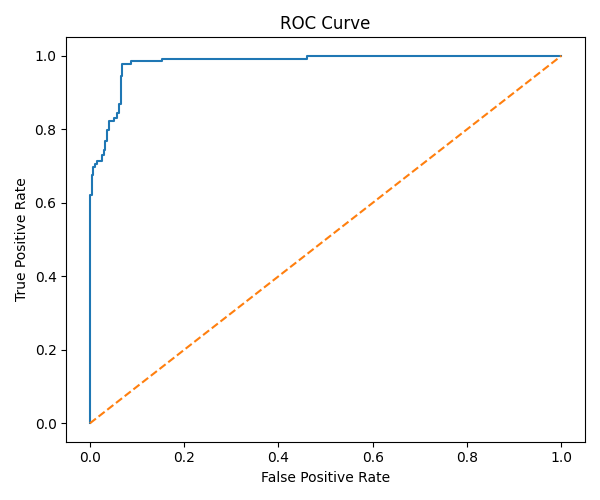
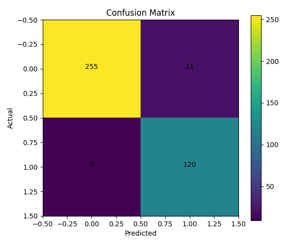
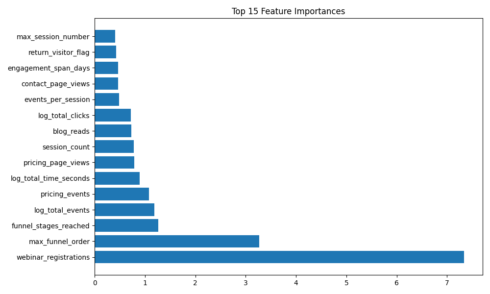

# 🎯 Lead Conversion Prediction System
### AI/ML Engineer Assessment — Vynqe
**Developed by:** [Vikas Maurya](https://github.com/vikasmaurya)

[](https://www.python.org/downloads/)
[](https://fastapi.tiangolo.com/)
[](https://xgboost.ai/)

---

## 🚀 Live Demo

* **Deployed API:** [https://vikas-maurya-aiml-assessment.onrender.com](https://vikas-maurya-aiml-assessment.onrender.com)
* **Interactive Swagger UI:** Append `/docs` to the live URL
* **Health Check Endpoint:** Append `/health` to the live URL

> 💡 **Note:** The free tier of Render automatically spins down services after periods of inactivity. Your first request may take 20–30 seconds to wake up the server.

---

## 📋 Table of Contents

- [Overview](#overview)
- [System Architecture & Features](#-system-architecture--features)
- [Project Structure](#-project-structure)
- [Tech Stack](#-tech-stack)
- [Quick Start & Local Setup](#-quick-start--local-setup)
- [Model Training Pipeline](#-model-training-pipeline)
- [API Production Deployment](#-api-production-deployment)
- [API Endpoints Specification](#-api-endpoints-specification)
- [Model Performance & Evaluation](#-model-performance--evaluation)
- [Key Insights from EDA](#-key-insights-from-eda)
- [Data Leakage Guardrails](#-data-leakage-guardrails)
- [Limitations & Roadmap](#-limitations--roadmap)
- [Author](#-author)

---

## Overview

This system addresses a core B2B growth problem: **identifying high-value leads based on firmographic profiles and behavioral intent data.**

By blending exploratory data analysis (EDA), rigorous target variable engineering, robust data leakage prevention, and automated machine learning selection, this end-to-end framework delivers high-accuracy conversion scores alongside human-readable feature explanations via a high-performance REST API. 

---

## 🛠️ System Features

* **Target Label Synthesis:** Automates the creation of an explicit target variable derived strictly from high-intent downstream events.
* **AutoML Selection Pipeline:** Evaluates and benchmarks four competitive algorithms, choosing the optimal checkpoint based on macro F1-score optimization.
* **Production REST Layer:** Low-latency inference powered by FastAPI, featuring complete runtime schema validation via Pydantic.
* **Explainable AI Hook:** Provides immediate, clear qualitative explanations for generated probability scores to bridge the gap between ML outputs and sales operations.

---

## 📂 Project Structure

```text
vikas-maurya-AIML-Assessment/
├── README.md
├── analysis.md
├── requirements.txt
├── train.py
├── app.py
├── data/
│   ├── leads (1).csv                
│   └── interactions (1).csv         
├── models/
│   └── model.pkl                 # Best performing serialized model
├── notebooks/
│   └── EDA.ipynb                 # Interactive data exploration
├── outputs/
│   ├── eda/                      # Visual distributions & behavioral metrics
│   │   ├── conversion_distribution.png
│   │   ├── conversion_by_source.png
│   │   ├── conversion_by_segment.png
│   │   └── ...
│   └── model/                    # Visual evaluation metrics
│       ├── model_metrics.json
│       ├── feature_importance.png
│       ├── confusion_matrix.png
│       └── roc_curve.png
└── .gitignore
```

## Tech Stack
 
- **Python 3.10+**
- **Pandas, NumPy** — data manipulation and feature engineering
- **Scikit-learn** — model training, evaluation, preprocessing
- **XGBoost** — gradient boosted trees
- **FastAPI + Uvicorn** — REST API
- **Pydantic** — request/response validation
- **Matplotlib, Seaborn** — visualizations
- **Joblib** — model serialization

 
## Setup
 
### 1. Clone the repository
 
```bash
git clone https://github.com/vikasmaurya/vikas-maurya-AIML-Assessment.git
cd vikas-maurya-AIML-Assessment
```
 
### 2. Create and activate a virtual environment
 
```bash
python -m venv venv
 
# Windows
venv\Scripts\activate
 
# macOS / Linux
source venv/bin/activate
```
 
### 3. Install dependencies
 
```bash
pip install -r requirements.txt
```
 
### 4. Add data files
 
Place the provided CSV files into the `data/` folder:
 
```
data/
├── leads (1).csv
└── interactions (1).csv
```
 
These files are excluded from the repository via `.gitignore`.
 
---
 
## How to Train the Model
 
```bash
python train.py
```
 
This will:
 
1. Load `leads.csv` and `interactions.csv`
2. Derive the `converted` target label from high-intent interaction events
3. Train four models — Logistic Regression, Random Forest, Gradient Boosting, XGBoost
4. Select the best model by F1-score
5. Save the model artifact to `models/model.pkl`
6. Save evaluation outputs to `outputs/model/`
Expected terminal output:
 
```
12:14:07 [INFO] Loading leads from data/leads.csv
12:14:07 [INFO] Leads shape: (2045, 21) | Interactions shape: (40000, 36)
12:14:07 [INFO] Conversion rate: 31.8% (644 / 2025 leads)
12:14:08 [INFO] Final feature count: 10 | Samples: 2025
12:14:08 [INFO] Train shape: (1620, 10) | Test shape: (405, 10)
...
12:14:09 [INFO] Best model: Random Forest (F1=0.899)
12:14:11 [INFO] CV F1 scores: [0.895 0.886 0.917 0.899 0.913] | Mean: 0.902 ± 0.012
12:14:12 [INFO] Saved model artifact successfully
```
 
---
 
## How to Run the API
 
```bash
python -m uvicorn app:app --reload
```
 
The API will be available at `http://127.0.0.1:8000`  
Interactive Swagger docs at `http://127.0.0.1:8000/docs`
 
---
 
## API Endpoints
 
### `GET /`
 
Returns basic API info.
 
```json
{
  "message": "Lead Conversion Prediction API",
  "version": "1.0.0",
  "model": "Random Forest",
  "features_used": 10,
  "endpoints": ["/predict", "/explain", "/health"]
}
```
 
---
 
### `GET /health`
 
Returns model status and supported input values.
 
```json
{
  "status": "healthy",
  "model_loaded": true,
  "model_type": "RandomForestClassifier",
  "feature_count": 10,
  "supported_source_values": ["Direct", "Email Campaign", "Facebook", "Google", "Instagram", "LinkedIn", "Organic Search", "Referral"],
  "supported_company_sizes": ["Enterprise", "Large", "Medium", "Small"]
}
```
 
---
 
### `POST /predict`
 
Predicts whether a lead is likely to convert.
 
**Request:**
 
```json
{
  "source": "Google",
  "company_size": "Medium",
  "session_count": 5,
  "total_events": 18,
  "total_time_seconds": 900,
  "pricing_page_views": 3,
  "webinar_registrations": 1,
  "max_funnel_order": 4,
  "return_visitor_flag": true,
  "total_clicks": 42
}
```
 
**Response:**
 
```json
{
  "prediction": "ACCEPT",
  "conversion_probability": 0.7812,
  "confidence": "medium",
  "risk_level": "medium"
}
```
 
**Field descriptions:**
 
| Field | Type | Description |
|-------|------|-------------|
| `source` | str | Acquisition channel — Google, LinkedIn, Facebook, Instagram, Direct, Referral, Email Campaign, Organic Search |
| `company_size` | str | Small / Medium / Large / Enterprise |
| `session_count` | int | Total number of sessions |
| `total_events` | int | Total interaction events across all sessions |
| `total_time_seconds` | float | Total time spent on site in seconds |
| `pricing_page_views` | int | Number of visits to the Pricing page |
| `webinar_registrations` | int | Number of webinar registration events |
| `max_funnel_order` | int | Deepest funnel stage reached — 1=Awareness, 2=Consideration, 3=Evaluation, 4=Decision |
| `return_visitor_flag` | bool | Whether the lead has returned for a subsequent session |
| `total_clicks` | int | Total click events across all interactions |
 
---
 
### `POST /explain`
 
Returns a human-readable explanation of the conversion prediction.
 
**Request:**
 
```json
{
  "conversion_probability": 0.78,
  "session_count": 5,
  "pricing_page_views": 3,
  "webinar_registrations": 1,
  "max_funnel_order": 4,
  "total_events": 18
}
```
 
**Response:**
 
```json
{
  "summary": "The lead viewed pricing-related content, indicating purchase intent. The lead registered for a webinar, suggesting active engagement. The lead progressed to the decision stage of the sales funnel. Multiple sessions indicate continued interest in the product. A high number of interactions reflects strong engagement."
}
```
 
---
 
## Model Performance
 
Four models were trained and evaluated on an 80/20 stratified split.
 
| Model | Accuracy | Precision | Recall | F1 | AUC-ROC |
|-------|----------|-----------|--------|----|---------|
| Logistic Regression | 0.904 | 0.785 | 0.961 | 0.864 | 0.972 |
| **Random Forest** ✅ | **0.931** | **0.844** | **0.961** | **0.899** | **0.982** |
| Gradient Boosting | 0.926 | 0.878 | 0.892 | 0.885 | 0.983 |
| XGBoost | 0.916 | 0.863 | 0.876 | 0.869 | 0.982 |
 
**Best model: Random Forest** — selected on the basis of highest F1-score (0.899).
 
5-fold cross-validation confirmed the result: **CV F1 = 0.902 ± 0.012**, showing stable generalization across different data splits.
 
All four models exceed the "Excellent" threshold defined in the evaluation criteria (F1 > 0.75, AUC-ROC > 0.80) by a substantial margin.
 
### ROC Curve
 

 
The ROC curve hugs the top-left corner with an AUC of 0.982, indicating the model reliably distinguishes between converted and non-converted leads across all decision thresholds.
 
### Confusion Matrix
 

 
On the held-out test set of 405 leads:
- **253 true negatives** — correctly identified non-converting leads
- **124 true positives** — correctly identified converting leads
- **23 false positives** — non-converters incorrectly flagged
- **5 false negatives** — converters missed by the model
The false negative count (5) is very low, meaning the model rarely misses a lead that would have converted — which is the more costly error in a sales context.
 
### Feature Importance
 

 
The top features by importance in the Random Forest model:
 
| Feature | Importance | What it captures |
|---------|-----------|-----------------|
| `total_time_seconds` | 0.218 | Overall engagement depth |
| `webinar_registrations` | 0.184 | High-intent event participation |
| `total_clicks` | 0.168 | Active browsing behaviour |
| `total_events` | 0.147 | Interaction volume |
| `max_funnel_order` | 0.110 | Funnel progression depth |
| `session_count` | 0.084 | Return frequency |
| `pricing_page_views` | 0.057 | Pricing interest signal |
| `source` | 0.015 | Acquisition channel quality |
| `company_size` | 0.014 | Firmographic context |
| `return_visitor_flag` | 0.004 | Re-engagement indicator |
 
Time on site, webinar participation, and click activity are the dominant drivers. Funnel depth and session count reinforce these signals. Firmographic features like source and company size add context but are less decisive than behavioral engagement.
 
---
 
## Key Findings from EDA
 
The exploratory analysis guided both feature selection and model design. A few findings that stood out:
 
**Funnel depth is the single strongest conversion signal.** Leads who reached the Decision stage converted at ~63%, versus just ~2% for those who never moved past Awareness. Any feature that captures funnel progression will carry significant weight.
 
**Session count separates intent from curiosity.** Converted leads averaged around 8 sessions; non-converted leads averaged about 3.5. Repeat engagement is a genuine buying signal.
 
**Pricing page visits are a pre-purchase behaviour.** Converted leads visited the pricing page nearly 3 times on average, compared to about 1.2 times for non-converters.
 
**Instagram underperforms badly.** With a conversion rate of ~15% versus ~37% for LinkedIn and Google, continuing to invest in Instagram at the same rate is inefficient.
 
**Interns never converted.** Not a single intern-sourced lead converted in the dataset. Simple qualification filters could remove these from the pipeline entirely.
 
---
 
## Data Leakage Prevention
 
Features used to define the conversion label — `demo_requests`, `free_trial_starts`, `contact_form_submits`, and `form_completed` — were deliberately excluded from the model inputs. Including them would allow the model to predict conversion using the very events that define it, making metrics meaningless on real unseen data.
 
---
 
## Limitations
 
- **Static dataset** — the model was trained on a fixed snapshot. In production, lead behavior patterns may shift over time (concept drift), which would require periodic retraining.
- **Rule-based explanations** — the `/explain` endpoint uses hand-crafted logic rather than model-level attribution (e.g. SHAP values), which would give more accurate feature-level explanations.
- **Compact feature set** — the deployed model uses 10 features for API simplicity. A richer feature set was engineered during training but trimmed for the inference interface.
- **No probability calibration** — the predicted probabilities reflect model confidence but haven't been calibrated against empirical conversion rates.
---
 
## Future Improvements
 
- Add SHAP-based explanations to the `/explain` endpoint for accurate per-prediction attribution
- Implement probability calibration (Platt scaling or isotonic regression)
- Add a `/batch_predict` endpoint for scoring multiple leads in one call
- Set up model monitoring to detect performance drift in production
- Explore sequence models (LSTM) to capture temporal patterns in session order
- Containerize with Docker for consistent deployment across environments
---
 
## Author
 
**Vikas Maurya**  
Interests: Machine Learning, NLP, Generative AI
 
---
 
*Assessment submitted for the AI/ML Engineer role at Vynqe — June 2026*
 
