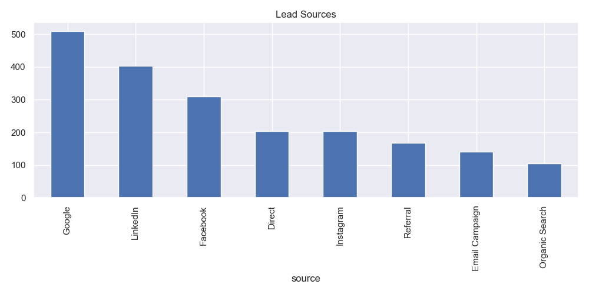
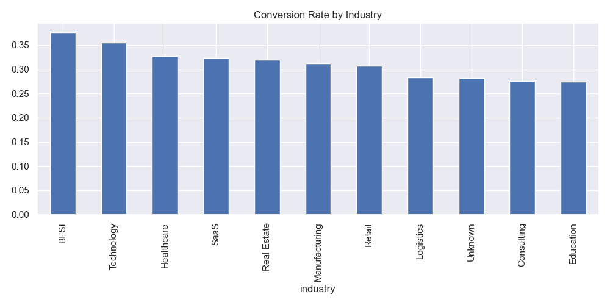
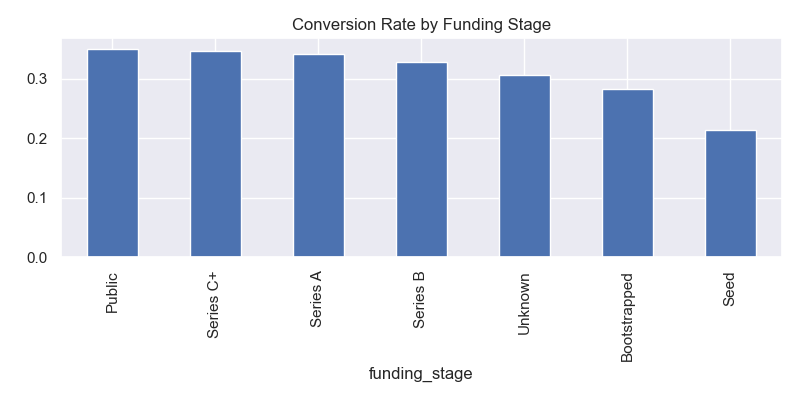
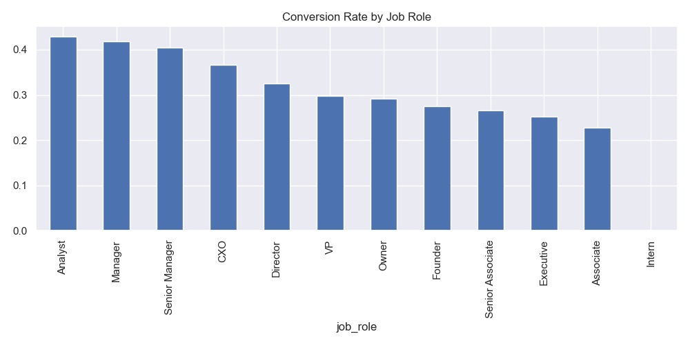

# Exploratory Data Analysis — Lead Conversion Prediction
 
**Project:** AI/ML Engineer Assessment — Lead Conversion Prediction  
**Author:** Vikas Maurya  
**Date:** June 2026
 
---
 
## 1. Introduction
 
The goal of this analysis was to understand what makes a lead convert — and what doesn't. Before building any model, it made sense to spend time exploring the data, checking its quality, and finding patterns that could guide feature engineering and model design.
 
Two datasets were used:
 
- **Leads Dataset** — profile and firmographic information for each lead, covering things like acquisition source, company segment, job role, and funding stage.
- **Interactions Dataset** — behavioral logs capturing every session, page view, click, and funnel event generated by each lead on the platform.
---
 
## 2. Target Variable Creation
 
The leads dataset didn't come with a ready-made `converted` column, so the target had to be derived from the interactions data. A lead was considered converted if they performed any of the following high-intent actions:
 
- Submitted a demo request
- Started a free trial
- Submitted the contact form
- Completed any form (`form_completed == True`)
After deduplication, roughly **644 out of 2,025 leads** were marked as converted — an overall conversion rate of about **32%**.
 

 
The dataset is moderately imbalanced — for every lead that converts, about two don't. This was accounted for during model training using class weighting rather than oversampling, which tends to produce more stable results on real-world data.
 
---
 
## 3. Data Quality
 
### 3.1 Missing Values — Leads
 
The leads dataset was largely clean. Only four columns had any missing values, and in each case the percentage was under 5%:
 
| Column | Missing |
|--------|---------|
| `browser` | ~100 |
| `company_size` | ~100 |
| `annual_revenue_band` | ~40 |
| `city` | ~40 |
 
All four were filled with an `"Unknown"` category. No rows were dropped.
 

 
### 3.2 Missing Values — Interactions
 
The interactions file had more complex missing patterns. `form_name` and `form_step` were missing in about 80% of rows — but this is expected, since those fields only get populated when a form event actually occurs. Similarly, UTM parameters were missing in around 18–19% of rows, most likely from direct traffic where tracking tags aren't present.
 
None of these were data quality issues. They were handled with zero-fill or dropped where not needed.
 
### 3.3 Duplicate Records
 
There were 20 duplicate lead IDs in the leads file, making the raw row count 2,045 but the unique count 2,025. Duplicates were removed by keeping the first occurrence — a minor issue, likely from an upstream pipeline.
 
### 3.4 Outliers and Anomalies
 
**Employee count** was heavily right-skewed. Most companies had somewhere between 100 and 1,000 employees (median around 350), but a handful of enterprise accounts went up to 250,000. These aren't errors — they represent real large organisations — so they were kept but log-transformed during feature engineering.
 
Two other anomalies stood out in the interactions data:
 
- A few rows had **negative session durations** (as low as -113 seconds). These are likely tracking or clock-sync artifacts and were clipped to zero.
- **Scroll depth exceeded 100%** in some rows, which is physically impossible. These values were capped at 100 during preprocessing.
---
 
## 4. Lead Source Distribution
 
Google brought in the most leads by a clear margin — around 500 — followed by LinkedIn at roughly 400. Facebook was third at about 300. Direct, Instagram, Referral, Email Campaign, and Organic Search all sat in the 100–200 range.
 

 
But volume alone doesn't tell the full story. The more important question is which sources produce leads that actually convert.
 
---
 
## 5. Conversion Rate by Source
 

 
**LinkedIn and Google both sit around 37%** — the top performers. Email Campaign isn't far behind at roughly 35%. Direct and Organic Search are in the low 30s, and Referral and Facebook are a little lower.
 
Instagram is the clear outlier. With a conversion rate of only about **15%**, it's delivering leads at less than half the quality of the top channels. Given that it also generates a couple hundred leads, there's a real cost here — a lot of pipeline volume that rarely converts. Whether this is an audience targeting problem or a messaging issue, it's worth investigating.
 
---
 
## 6. Conversion Rate by Lead Segment
 

 
Enterprise leads convert at close to **40%**, the highest of any segment. Mid-Market follows at around **33%**. Once you drop to Startup (~22%) and SMB (~19%), the numbers fall noticeably.
 
The gap between Enterprise and SMB is roughly 2x. Larger organisations tend to have allocated budgets, more structured evaluation processes, and a clearer sense of what they need — all of which translates into stronger conversion rates. SMB leads, by contrast, may be exploring without a clear mandate or timeline.
 
---
 
## 7. Conversion by Funnel Stage
 

 
This was one of the most striking findings in the whole analysis. The funnel has four stages — Awareness, Consideration, Evaluation, and Decision — and where a lead ends up in the funnel is one of the strongest predictors of whether they convert.
 
| Funnel Stage | Approx. Conversion Rate |
|---|---|
| Awareness only | ~2% |
| Consideration | ~15% |
| Evaluation | ~34% |
| Decision | ~62% |
 
Leads who never move past Awareness almost never convert. But once someone reaches the Decision stage, nearly two in three end up converting. This is a massive signal, and funnel depth ended up being one of the most important features in the final model.
 
---
 
## 8. Session Behavior Analysis
 

 
Converted leads came back significantly more often. The median session count for a converted lead was around **8**, versus just **2** for non-converted leads. The mean tells the same story — converted leads averaged about 8 sessions compared to roughly 3.5 for those who didn't convert.
 
The boxplot makes this difference visually clear. Non-converted leads cluster near the bottom, while converted leads occupy a notably higher and wider range. There are a few outliers on the non-converted side — people who visited many times but still didn't buy — but these are the exception rather than the rule. Frequency of return is a genuine buying signal.
 
Beyond session count, converted leads also visited the **pricing page about 2.8 times on average**, compared to roughly 1.2 times for non-converted leads. When someone keeps coming back to look at pricing, they're seriously considering a purchase.
 
---
 
## 9. Conversion Rate by Industry
 

 
BFSI (Banking, Financial Services, and Insurance) converted at the highest rate — just under **37%**. Technology was close behind at around **35%**. Healthcare and SaaS sat in the low 30s, which is still solid.
 
At the lower end, Consulting and Education came in around 27%. The spread across industries isn't enormous — most fall somewhere in the 27–37% range — so industry on its own isn't a particularly powerful differentiator. But it does add useful context when combined with firmographic and behavioral features.
 
---
 
## 10. Conversion Rate by Funding Stage
 

 
More mature companies convert better. Public and Series C+ leads both sit around **35%**. Series A and B are close behind in the low-to-mid 30s.
 
Bootstrapped companies drop to around **28%**, and Seed-stage companies are the weakest at about **21%**. Early-stage companies often lack both the budget and the internal buy-in to make a purchasing decision, even when interest is genuine. This doesn't mean they're worthless leads — but they likely need a longer nurture cycle.
 
---
 
## 11. Conversion Rate by Job Role
 

 
This finding was a bit counterintuitive. You might expect senior executives to be the strongest leads, but **Analysts convert at about 43%**, followed by Managers and Senior Managers in the low 40s. CXOs are around 36%, and VPs drop to around 30%.
 
Interns sit at **0%** — not a single intern converted in the entire dataset. This makes sense: interns are typically browsing, researching, or doing competitive analysis on behalf of someone else. They're not decision makers and probably shouldn't be treated as serious pipeline.
 
The broader pattern suggests that mid-level practitioners — people who actually evaluate and use tools day-to-day — are often more serious buyers than senior executives who delegate the evaluation process.
 
---
 
## 12. Employee Count Distribution
 
Employee count had a heavily skewed distribution that needed attention before modelling.
 
The raw data showed a long tail — most companies had a few hundred employees, but a small number of enterprise accounts pushed the maximum to 250,000. Using this feature as-is would give those extreme values disproportionate influence.
 
Applying a log transformation produced a much more balanced distribution while preserving the relative ordering of companies by size. This is the version used in feature engineering.
 
---
 
## 13. Correlation Analysis
 
A correlation heatmap was generated across all numeric features after feature engineering. A few things stood out:
 
- `session_count` had a clear positive correlation with conversion — the more a lead came back, the more likely they were to convert
- Pricing-related engagement (pricing page views, pricing events) showed positive correlations with the target
- `employee_count` showed a mild positive relationship — larger companies convert slightly more often
- `company_age_years` had a weak positive signal
- No severe multicollinearity issues were found among the primary engineered features
---
 
## 14. Key Business Insights
 
Pulling together everything from the analysis, a few findings stood out clearly:
 
**Funnel depth is the strongest single predictor.** The jump from Consideration (~15%) to Decision (~62%) is enormous. Any feature capturing how deep into the funnel a lead got will carry significant weight in the model.
 
**Session frequency signals genuine intent.** Leads who came back 8 times were far more likely to convert than those who visited once. Repeat engagement is a real buying signal — not just noise.
 
**Pricing page visits are a pre-purchase behaviour.** Converted leads visit the pricing page more than twice as often as non-converted ones. A lead on their third pricing page visit is probably in the final stages of their decision.
 
**Instagram leads need re-evaluation.** Conversion rate around 15% — half of LinkedIn or Google — suggests either the audience is wrong or the messaging isn't landing. Continuing to invest at the same rate without addressing this is wasteful.
 
**Interns don't convert.** A simple filter here cleans up the pipeline at no cost.
 
**Seed-stage companies are weak leads.** Not worth heavy investment — better suited for a low-touch automated nurture sequence until they mature.
 
---
 
## 15. Impact on Feature Engineering and Modelling
 
The EDA directly shaped what went into the model. The following feature groups were prioritised:
 
- **Funnel features** — max funnel order, decision-stage visit count, funnel stages reached
- **Session engagement** — session count, total events, events per session, total time on site
- **Intent page signals** — pricing page views, demo page views, ROI calculator visits
- **Firmographic context** — segment, funding stage, job role, industry, acquisition source
- **Recency and frequency** — engagement span in days, return visitor flag, max session number
One important decision: features like `demo_requests`, `free_trial_starts`, `contact_form_submits`, and `form_completed` were deliberately **excluded from model inputs**. These were used to define the conversion label, so including them would be data leakage — the model would essentially be predicting conversion using the very events that define it.
 
