# Exploratory Data Analysis — Lead Conversion Prediction

**Project:** AI/ML Engineer Assessment — Lead Conversion Prediction  
**Author:** Vikas Maurya  
**Date:** June 2026

---

## 1. Introduction

The goal of this analysis was to understand what makes a lead convert — and what doesn't. Before building any model, it made sense to spend time exploring the data, checking its quality, and finding patterns that could guide feature engineering and model design.

Two datasets were used:

- **Leads Dataset** — profile and firmographic information for each lead, covering things like acquisition source, company segment, job role, and funding stage.
- **Interactions Dataset** — behavioral logs capturing every session, page view, click, and funnel event generated by each lead on the platform.

---

## 2. Dataset Overview

| Dataset | Rows | Columns |
|---------|------|---------|
| `leads.csv` | 2,045 | 21 |
| `interactions.csv` | 40,000 | 36 |

Both files were loaded and inspected for structure, types, and data quality before any analysis was performed.

---

## 3. Data Quality

### 3.1 Missing Values — Leads

The leads dataset was largely clean. Only four columns had any missing values, all under 5%:

| Column | Missing |
|--------|---------|
| `browser` | ~100 |
| `company_size` | ~100 |
| `annual_revenue_band` | ~40 |
| `city` | ~40 |

All four categorical columns were filled with `"Unknown"`. Numeric columns (`employee_count`, `company_age_years`) were filled with their respective medians. No rows were dropped.

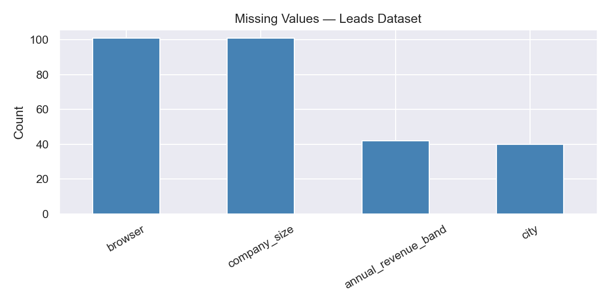

### 3.2 Missing Values — Interactions

The interactions file had more complex missing patterns. `form_name` and `form_step` were missing in roughly 80% of rows — but this is structural, not a data quality issue. Those fields only get populated when a form event actually occurs. Similarly, UTM parameters (`utm_source`, `utm_medium`) were missing in around 18–19% of rows, expected from direct traffic with no tracking tags.

None of these were treated as errors. They were handled with zero-fill or dropped during aggregation.

### 3.3 Duplicate Records

The leads file had **20 duplicate lead IDs**, making the raw row count 2,045 but unique count 2,025. Duplicates were removed by keeping the first occurrence. A minor issue, likely from an upstream data pipeline.

### 3.4 Outliers and Anomalies

**Employee count** was heavily right-skewed. The median was around 350 employees, but a small number of enterprise accounts reached up to 250,000. These are real companies — not errors — so they were retained but log-transformed during feature engineering to prevent them from dominating the model.

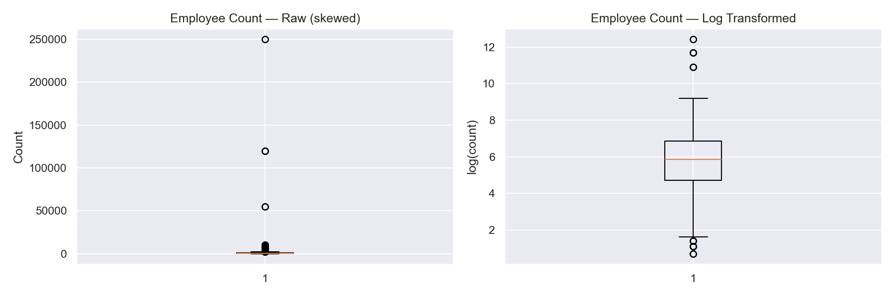

**Timestamp range** in interactions spanned from early January 2026 to mid-July 2026 — a period of about 179 days. No interactions were found before their lead's creation date, confirming the timestamps are clean.

---

## 4. Target Variable Creation

The leads dataset did not contain a `converted` column. The target variable was derived from high-intent interaction events. A lead was marked as **converted = 1** if they performed any of:

- `event_name == "demo_request"`
- `event_name == "free_trial_start"`
- `event_name == "contact_form_submit"`
- `form_completed == True`

After deduplication, **644 out of 2,025 leads converted** — an overall conversion rate of about **32%**.

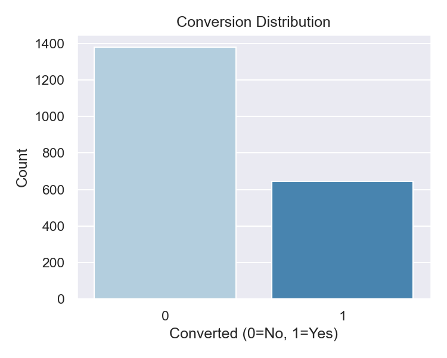

The dataset is moderately imbalanced — roughly 68% non-converted and 32% converted. This was handled during model training using `class_weight="balanced"` rather than oversampling, which tends to produce more stable generalization on real-world data.

---

## 5. Lead Source Analysis

Google brought in the highest volume at around 500 leads, followed by LinkedIn at roughly 400 and Facebook at about 300. Direct, Instagram, Referral, Email Campaign, and Organic Search all sat in the 100–200 range.

But volume alone doesn't determine quality. The more important question is which sources produce leads that actually buy.

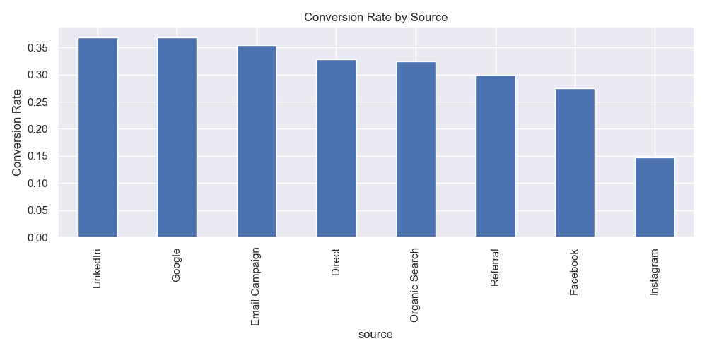

**LinkedIn and Google both sit around 37%** — the top performers. Email Campaign follows at roughly 35%. Direct and Organic Search are in the low 30s. Referral and Facebook sit a little lower.

Instagram is the clear outlier — a conversion rate of only about **15%**, less than half of LinkedIn or Google. Given that it also generates a few hundred leads, there is a real cost here. Whether this is a targeting problem or a messaging issue, it is worth investigating before continuing to invest at the same rate.

---

## 6. Lead Profile Analysis

The four charts below show conversion rates broken down by segment, industry, job role, and funding stage.

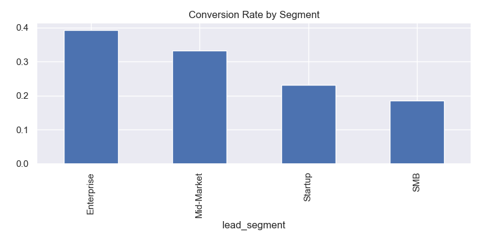

**By Segment:** Enterprise leads convert at close to 40%, the highest of any segment. Mid-Market follows at around 33%. Startup (~22%) and SMB (~19%) are noticeably lower. The gap between Enterprise and SMB is roughly 2x — larger organisations tend to have allocated budgets and more structured evaluation processes.

**By Industry:** BFSI converted at the highest rate (just under 37%), followed by Technology (~35%), Healthcare, and SaaS in the low 30s. Consulting and Education came in around 27%. The spread is not enormous — most industries fall between 27–37% — so industry adds useful context but is not a decisive predictor on its own.

**By Job Role:** Analysts converted at about 43%, followed by Managers and Senior Managers in the low 40s. CXOs were around 36%, and VPs dropped to around 30%. Interns sat at **0%** — not a single intern-sourced lead converted in the entire dataset. Mid-level practitioners who actively evaluate tools tend to be more serious buyers than senior executives who delegate the process.

**By Funding Stage:** Public and Series C+ leads converted at around 35%. Series A and B were close behind. Bootstrapped companies dropped to ~28% and Seed-stage to ~21%. Early-stage companies often lack the budget or internal buy-in needed to make a purchasing decision, even when interest is genuine.

---

## 7. Behavioral Analysis

### 7.1 Funnel Progression vs Conversion

This was one of the strongest findings in the entire analysis. The sales funnel has four stages — Awareness, Consideration, Evaluation, and Decision — and where a lead reached is a powerful predictor of whether they converted.

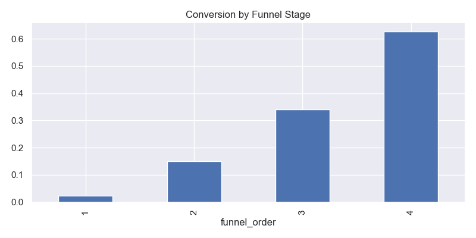

| Funnel Stage | Conversion Rate |
|---|---|
| Awareness only | ~2% |
| Consideration | ~15% |
| Evaluation | ~34% |
| Decision | ~62% |

Leads who never moved past Awareness almost never converted. Once someone reached the Decision stage, nearly two in three converted. This is a massive signal — funnel depth became one of the most important features in the final model.

### 7.2 Session Count vs Conversion

Converted leads came back significantly more often. The median session count for a converted lead was around **8**, versus just **2** for non-converted leads. The mean tells the same story — converted leads averaged about 8.4 sessions versus roughly 3.6 for those who did not convert.

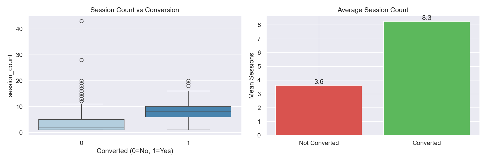

The boxplot makes this difference clear. Non-converted leads cluster near the bottom, while converted leads occupy a notably higher and wider range. A few outliers on the non-converted side — people who visited many times but still did not buy — but these are the exception. Frequency of return is a genuine buying signal.

### 7.3 Pricing Page Views vs Conversion

Converted leads visited the pricing page about **2.8 times on average**, compared to roughly **1.2 times** for non-converted leads.

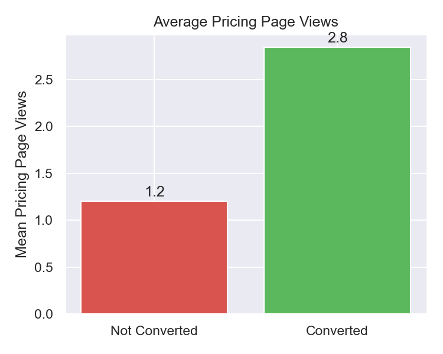

When someone keeps coming back to look at pricing, they are seriously considering a purchase. A lead on their third pricing visit is likely in the final stages of their decision — a good moment for a targeted follow-up.

---

## 8. Temporal Analysis

### 8.1 Monthly Volume and Conversion Rate

The interaction data spans January to July 2026. Traffic grew steadily from January through March, then remained elevated through May.

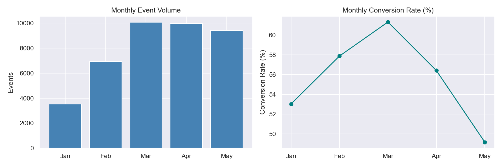

| Month | Events | Conv. Rate |
|-------|--------|------------|
| January | ~3,500 | ~53% |
| February | ~6,900 | ~58% |
| March | ~10,100 | ~61% |
| April | ~10,000 | ~56% |
| May | ~9,400 | ~49% |

March was the standout month — highest volume and highest conversion rate at the same time. May shows a warning: high volume but the lowest conversion rate in the dataset. That pattern suggests a campaign brought in high-traffic but lower-intent leads.

### 8.2 Day of Week — High-Intent Events

Not all days are equal when it comes to serious purchase intent.

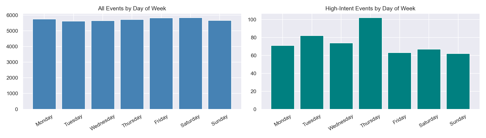

Thursday generated the most high-intent events (demo requests, trial starts, form submissions) — about 65% more than Sunday. Mid-week (Tuesday through Thursday) is when leads take meaningful action. Sales outreach scheduled for Thursday mornings would catch leads at their peak intent moment.

### 8.3 Time to Conversion

The sales cycle is not short.

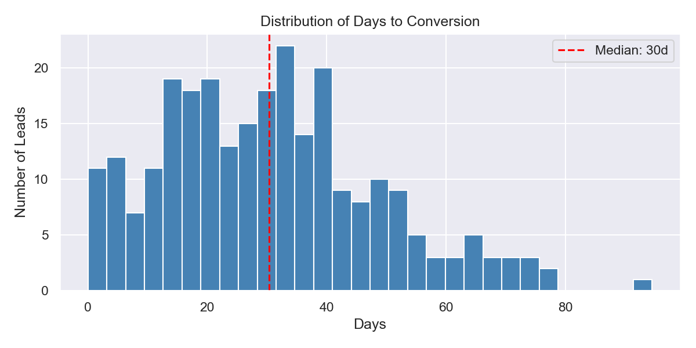

| Metric | Value |
|--------|-------|
| Median days to convert | ~30 days |
| Mean days to convert | ~38 days |
| Converted same day | ~5 leads |
| Converted within 7 days | ~23 leads |
| Took longer than 30 days | ~130 leads |

The median lead takes a full month from their first visit to converting. Only 5 leads converted on the same day. Most nurture sequences that stop at two or three weeks are cutting off too early for this audience.

### 8.4 Temporal Features — Correlation with Conversion

Three time-based features were engineered and tested against conversion:

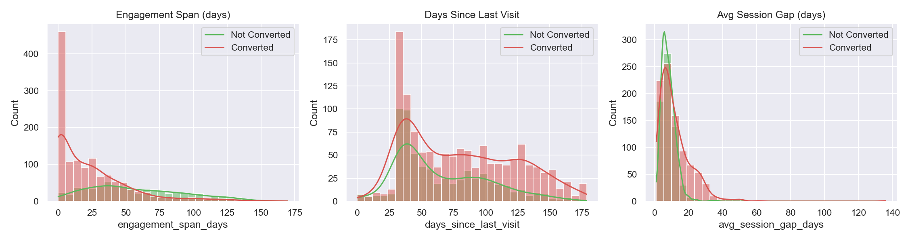

| Feature | Correlation | Converted avg | Not converted avg |
|---------|-------------|---------------|-------------------|
| `engagement_span_days` | **+0.46** | ~57 days | ~23 days |
| `avg_session_gap_days` | **-0.24** | ~8 days | ~12 days |
| `days_since_last_visit` | **-0.18** | ~65 days | ~81 days |

`engagement_span_days` had the strongest signal of any temporal feature — a correlation of +0.46 with conversion. Leads who stayed active for nearly two months converted far more than those who disappeared after three weeks.

`avg_session_gap_days` showed a negative correlation: tighter gaps (returning every 8 days) indicate a lead in an active evaluation cycle. Wider gaps signal fading interest.

`days_since_last_visit` shows that recent leads are warmer. A lead whose last visit was 65 days ago is much more likely to convert than one who went quiet 80+ days ago.

Business hours, weekend activity, and night browsing were also tested — all showed near-zero correlation (~0.01) and were excluded to avoid adding noise.

---

## 9. Feature Correlation Heatmap

A correlation heatmap was generated across all key numeric features.

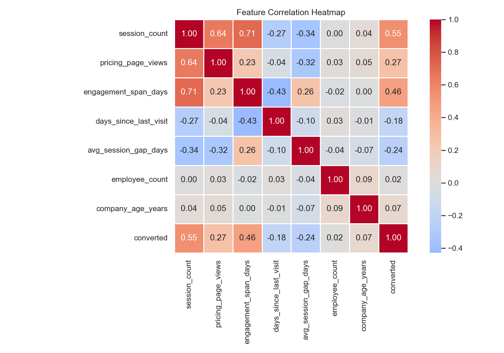

Key takeaways:

- `engagement_span_days` had the strongest positive correlation with conversion
- `session_count` and `pricing_page_views` both showed meaningful positive correlations
- `days_since_last_visit` showed a negative correlation — older leads convert less
- `employee_count` had a mild positive relationship — larger companies convert slightly more
- No severe multicollinearity was found among the selected features

---

## 10. Key Business Insights

| # | Finding | Business Action |
|---|---------|----------------|
| 1 | Decision-stage leads convert at 62% vs 2% for Awareness | Funnel depth is the #1 feature to track |
| 2 | Converted leads average 8 sessions vs 3.6 for non-converted | Session count is a strong model feature |
| 3 | Instagram converts at 15% vs LinkedIn/Google at 37% | Review and likely reduce Instagram spend |
| 4 | Median sales cycle is 30 days | Do not stop nurturing sequences before day 30 |
| 5 | March had peak volume AND peak conversion | Analyse and replicate March campaign conditions |
| 6 | Thursday has the most high-intent events | Schedule sales outreach on Thursday mornings |
| 7 | Interns never converted (0%) | Filter intern-role leads from active pipeline |
| 8 | Seed-stage companies convert at 21% vs Public at 35% | Prioritise Series A+ leads for outbound effort |
| 9 | `engagement_span_days` has +0.46 correlation | Add as a primary model feature |
| 10 | Pricing page viewed 2.8x more by converted leads | Trigger sales alert on a lead's 3rd pricing visit |

---

## 11. Impact on Feature Engineering and Modelling

The EDA directly shaped what went into the model. The following feature groups were prioritised:

- **Funnel features** — `max_funnel_order`, decision-stage visit count, funnel stages reached
- **Session engagement** — `session_count`, `total_events`, `total_time_seconds`, events per session
- **Intent signals** — `pricing_page_views`, `webinar_registrations`, `total_clicks`
- **Temporal features** — `engagement_span_days`, `days_since_last_visit`, `avg_session_gap_days`
- **Firmographic context** — `source`, `company_size`, lead segment, funding stage, job role

One important decision: features used to define the conversion label — `demo_requests`, `free_trial_starts`, `contact_form_submits`, and `form_completed` — were deliberately **excluded from model inputs**. Including them would be data leakage — the model would predict conversion using the very events that define it, producing inflated metrics that would not hold on real unseen data.
